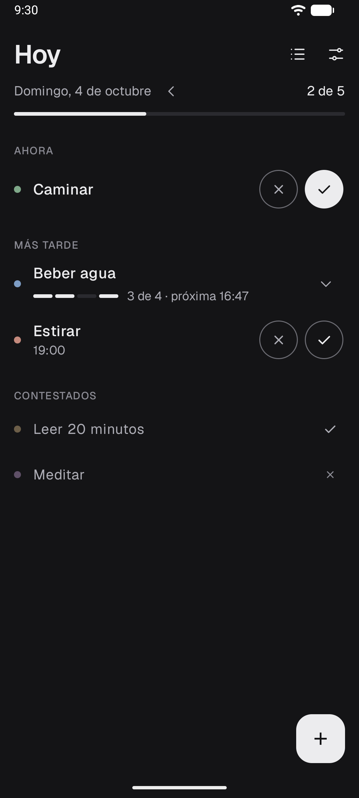
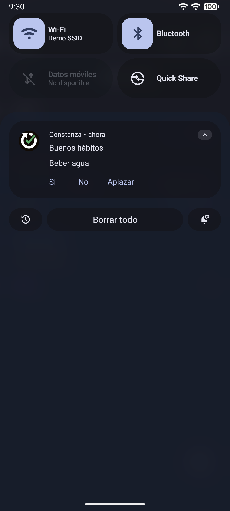
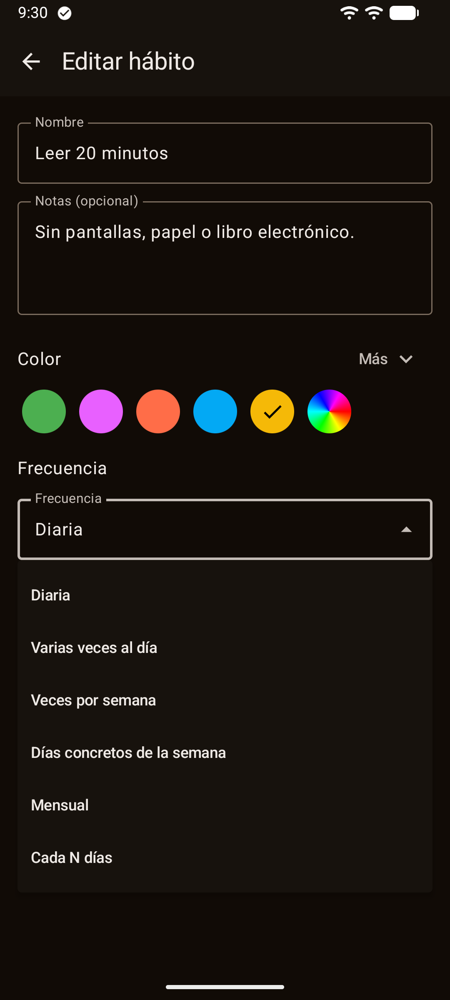
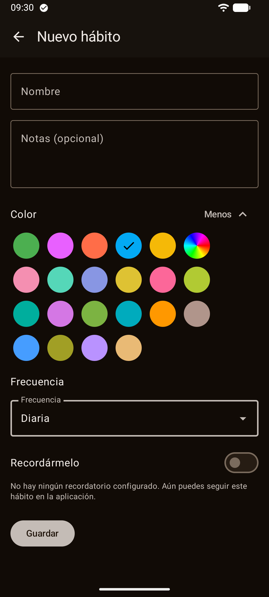
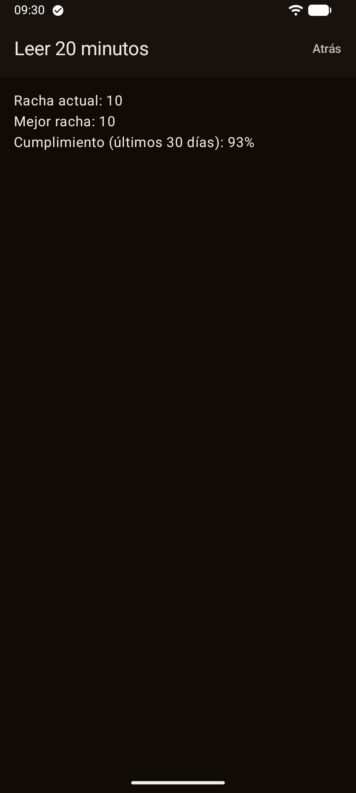
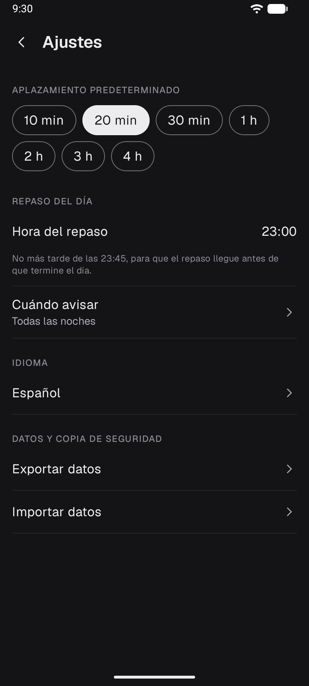
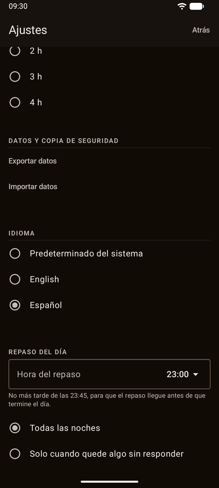

# Constanza — Buenos hábitos

<p align="center">
  <a href="README.md">English</a> · <strong>Español</strong>
</p>

<p align="center">
  
</p>

<p align="center">
  <strong>Hábitos con recordatorios que respondes sin abrir la app. Sin nube ni anuncios.</strong>
</p>

<p align="center">
  
  
  
  
  
  
</p>

<p align="center">
  <a href="https://play.google.com/store/apps/details?id=com.jjrapps.constanza">
    
  </a>
</p>

<p align="center">
  <br />
  <sub>Escanea el código con el móvil para ir directo a la ficha.</sub>
</p>

---

## Qué es

**Constanza** es una app de hábitos que se abre y se usa en segundos. No pide cuenta, no
sincroniza nada en la nube y no tiene anuncios ni analítica: no declara siquiera el permiso de
internet, así que no podría conectarse aunque quisiera.

Cada hábito tiene su propio color y su propia frecuencia. La pantalla Hoy agrupa lo que toca
ahora, lo que toca más tarde y lo que ya has contestado — y cuando llega el recordatorio, puedes
responderlo directamente desde la notificación, sin ni siquiera desbloquear el teléfono.

<p align="center">
  
  
  
  
  
  
  
</p>

---

## ✨ Funciones

### 🎨 Un color y una frecuencia para cada hábito

- 21 colores predefinidos, o uno personalizado con su propio selector de tono, saturación y
  brillo.
- Seis tipos de frecuencia: todos los días, varias veces al día, un número de veces por semana,
  días concretos de la semana, un día del mes, o cada N días.
- Cualquier frecuencia puede llevar una o varias horas de recordatorio.

### ✅ Responde en un toque — incluso desde la notificación

La pantalla Hoy agrupa lo que toca **ahora**, lo que toca **más tarde** y lo que ya has
**contestado**. Responder es un toque: Sí o No, sin abrir ningún diálogo. Y cuando llega el
recordatorio, puedes responderlo — Sí, No o Aplazar — directamente desde la notificación, sin
desbloquear el teléfono.

### 📉 Un día sin contestar se registra, nunca se oculta

Un día que no contestas no desaparece: a medianoche, cualquier hueco sin responder pasa a "No
hecho". Constanza no oculta lo que dejaste pasar para hacerte sentir mejor — lo registra, y ese
registro es la base de la racha y del cumplimiento.

### 📊 Progreso que significa algo

Para cada hábito: la racha actual, la mejor racha y el porcentaje de cumplimiento de los últimos
30 días.

### 🌙 Un repaso nocturno, a tu manera

Cada noche, a las 23:00 por defecto, un aviso de repaso te recuerda lo que quedó pendiente ese
día — o solo si de verdad quedó algo, si así lo prefieres.

### 💾 Tus datos, tu archivo

Exporta o importa todos tus datos como un archivo, con el selector de archivos del propio
sistema: es tu copia, no la nuestra.

### 🔔 Recordatorios que sobreviven a reinicios y cambios de hora

Los recordatorios sobreviven a un reinicio del teléfono y a un cambio de hora o de zona horaria:
no hace falta volver a abrir la app para que sigan sonando. Si tu teléfono no concede el permiso
de alarmas exactas por defecto, Constanza te avisa sin bloquear nada y te lleva al ajuste; si
prefieres no concedérselo, los recordatorios igualmente siguen llegando, solo que pueden hacerlo
con algunos minutos de margen.

### 🌐 Español e inglés

Sigue el idioma del sistema, y se puede cambiar desde Ajustes.

### 🌑 Oscura siempre

No hay modo claro. El fondo es deliberadamente neutro para que el único color de la pantalla sea
el que tú le has puesto a cada hábito.

### 🔒 Privada por diseño

- La app **no pide el permiso de internet**: no puede conectarse aunque quisiera.
- Sin cuentas, sin nube, sin anuncios, sin analítica y sin seguimiento.
- [Política de privacidad](https://jorgejiro.es/apps/constanza/privacidad/)

---

## 📲 Instalación

### Desde Google Play (recomendado)

<a href="https://play.google.com/store/apps/details?id=com.jjrapps.constanza">
  
</a>

Instálala desde [la ficha de Google Play](https://play.google.com/store/apps/details?id=com.jjrapps.constanza)
o escaneando el código QR de arriba. Así recibes las actualizaciones automáticamente.

### APK desde GitHub

Las APK firmadas se publican en
[Releases](https://github.com/jorgejiro/constanza-android/releases).

1. Descarga el `.apk` de la última release en el móvil.
2. Permite **Instalar aplicaciones desconocidas** para el navegador o el gestor de archivos.
3. Abre el `.apk` y pulsa **Instalar**.

O desde el ordenador:

```bash
adb install constanza-<versión>.apk
```

### Requisitos

| | |
| :--- | :--- |
| Android | 12 o superior (API 31) |
| Permisos | Notificaciones y, opcionalmente, alarmas exactas |
| Conexión | Ninguna |

---

## 🛠️ Stack técnico

| Capa | Tecnología |
| :--- | :--- |
| Lenguaje | Kotlin 2.4 |
| UI | Jetpack Compose + Material 3, tema oscuro único |
| Arquitectura | Hexagonal: `:domain` es Kotlin/JVM puro (rachas, cumplimiento, matemática de frecuencias — sin Android), `:app` contiene la UI en Compose y la integración con Android, organizado por funcionalidad |
| DI | Hilt (con KSP) |
| Persistencia | Room (hábitos y entradas) + DataStore Preferences (ajustes) |
| Trabajo en segundo plano | WorkManager + AlarmManager (recordatorios exactos, barrido de medianoche, reprogramación por reinicio o cambio de hora) |
| Serialización | kotlinx-serialization (exportación e importación de datos) |
| Concurrencia | Coroutines + Flow |
| Tests | JUnit 4, MockK, Turbine, Compose UI Test, detekt |

---

## 🚀 Compilar desde el código

### Requisitos previos

- JDK (el daemon de Gradle lo descarga si falta).
- Android SDK — AGP descarga la plataforma `android-37.0` (`compileSdk`/`targetSdk` = 37,
  `minSdk` = 31) automáticamente en el primer build si no está instalada.

### Clonar y compilar

```bash
git clone https://github.com/jorgejiro/constanza-android.git
cd constanza-android

./gradlew assembleDebug   # APK de depuración
./gradlew :domain:test    # tests unitarios JVM de :domain (JUnit4)
./gradlew check           # tests de ambos módulos + la regla detekt de acceso al reloj
```

### Linting

`./gradlew detekt` solo no aplica la regla de acceso al reloj: es solo-PSI y nunca resuelve los
nombres completos de las llamadas. Ejecuta `./gradlew detektMain` (ya conectado al `check` de
`:domain`) para aplicarla de verdad.

### Tests instrumentados, sin móvil

`./gradlew :app:emulatorMatrixGroupDebugAndroidTest` ejecuta toda la suite instrumentada en
emuladores API 31 y API 37 que el propio Gradle provisiona — no hace falta ningún teléfono.

---

## 📂 Estructura del proyecto

```text
├── app/src/main/kotlin/com/jjrapps/constanza/
│   ├── core/          # DI, base de datos Room, UI compartida y abstracción del tiempo
│   ├── habit/          # CRUD de hábitos, selector de color, editores de frecuencia
│   ├── tracking/       # Pantalla Hoy: ensamblado, respuesta y edición de entradas
│   ├── scheduling/      # Planificación con AlarmManager/WorkManager, reinicios y cambios de hora
│   ├── reminding/       # Notificaciones, acciones de la notificación, aplazamiento
│   ├── progress/        # Pantalla de racha y cumplimiento
│   ├── portability/      # Exportación e importación de datos como archivo
│   ├── localization/     # Selección de idioma
│   └── onboarding/       # Flujo de permisos del primer arranque
├── domain/src/main/kotlin/com/jjrapps/constanza/domain/
│   └── ...              # Kotlin puro: rachas, cumplimiento, matemática de frecuencias — sin Android
├── fastlane/metadata/     # Textos y capturas de la ficha de Play (en-US, es-ES)
└── gradle/libs.versions.toml
```

---

## 📚 Documentación

- [Guía de trabajo del repositorio](.claude/CLAUDE.md)
- [Especificaciones de funcionalidades](openspec/specs/)
- [Textos de la ficha de Google Play](docs/play-store-publication-texts.md)
- [Notas de la versión para Play](docs/play-release-notes.md)

---

## 💬 Sugerencias y errores

¿Algo no funciona como esperabas? Abre un [issue](https://github.com/jorgejiro/constanza-android/issues).

¿Echas en falta alguna función? Escribe a [jjrmobileapps@gmail.com](mailto:jjrmobileapps@gmail.com): leo y valoro todas las peticiones de mejora.

Y si te ayuda a mantener un hábito, una valoración en
[Google Play](https://play.google.com/store/apps/details?id=com.jjrapps.constanza) ayuda a que
la encuentre más gente.

---

## 📄 Licencia

Distribuido bajo la [licencia MIT](LICENSE).
