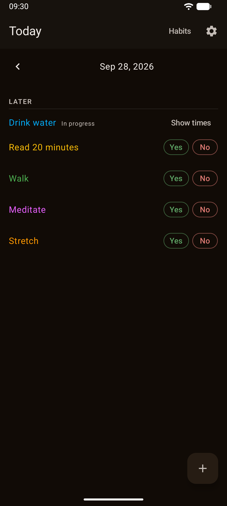
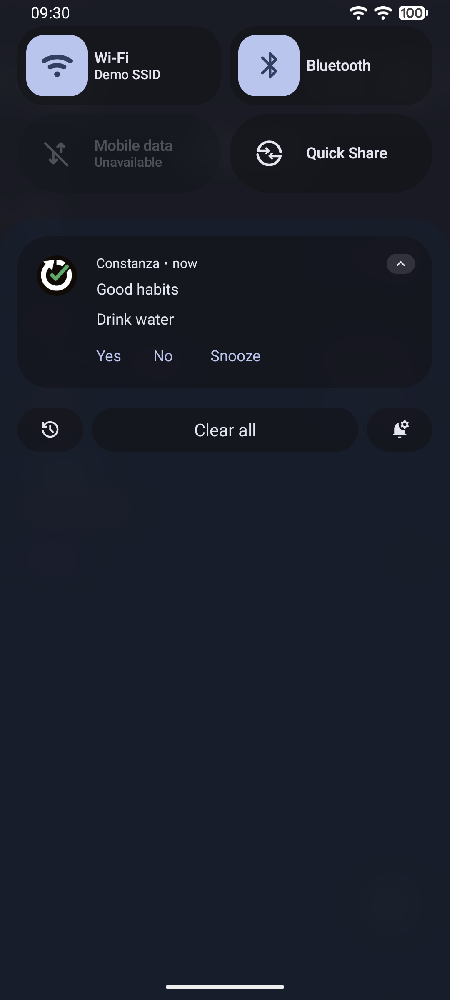
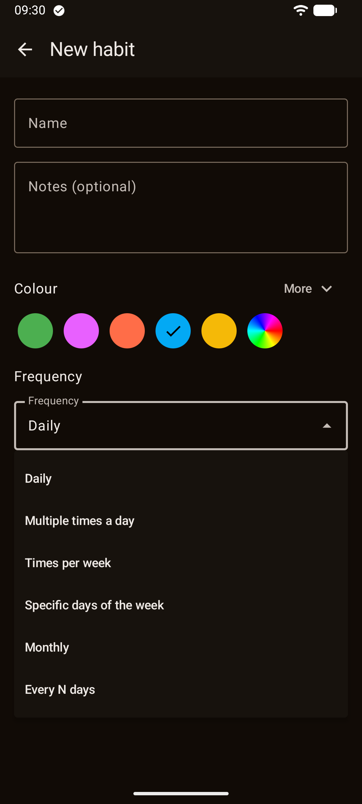
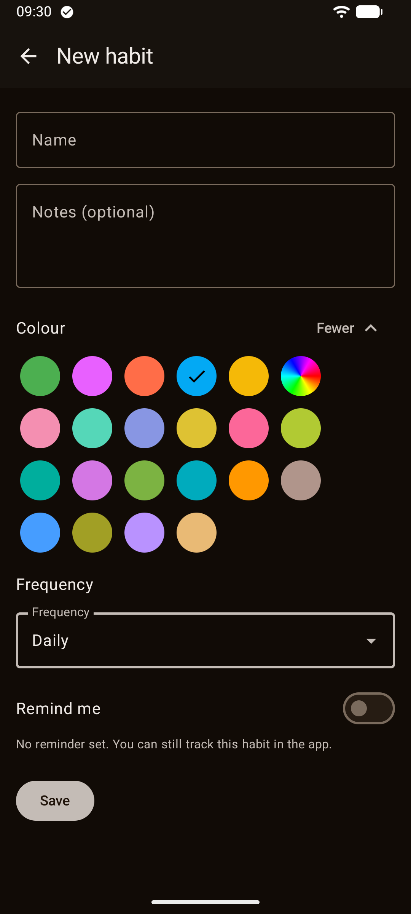
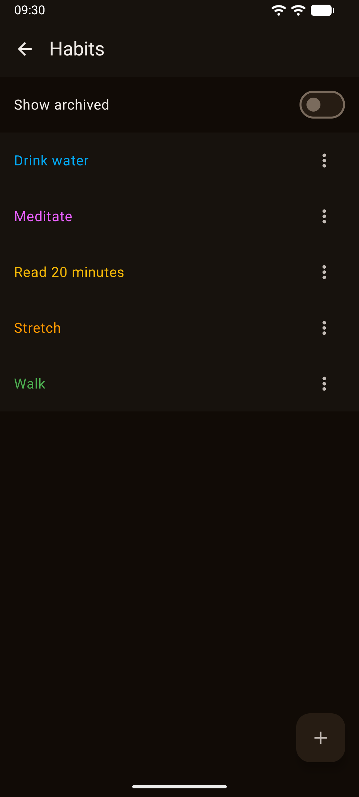
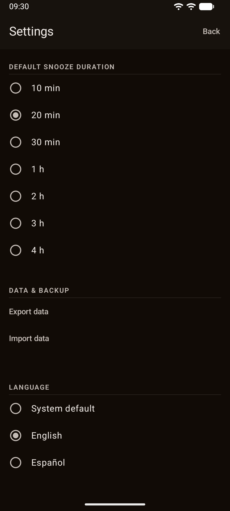
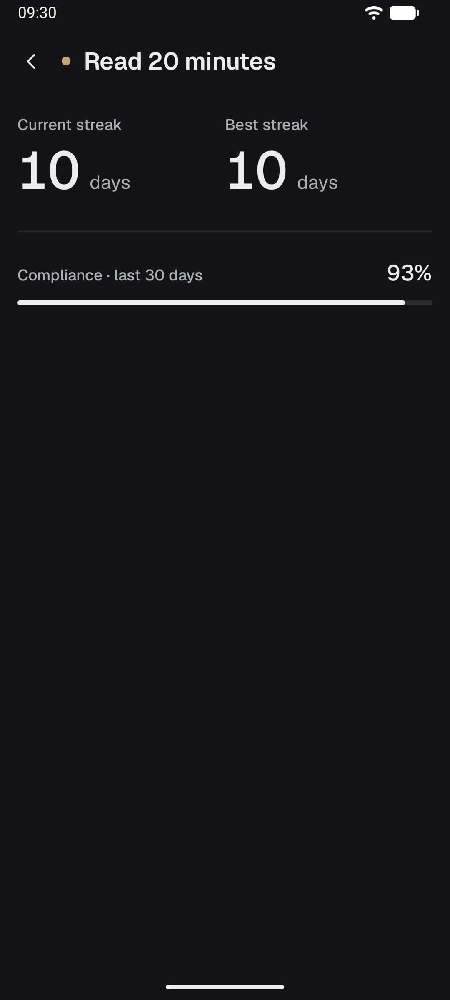

# Constanza — Good habits

<p align="center">
  <strong>English</strong> · <a href="README.es.md">Español</a>
</p>

<p align="center">
  
</p>

<p align="center">
  <strong>Habit reminders you answer without opening the app. No cloud, no ads.</strong>
</p>

<p align="center">
  
  
  
  
  
  
</p>

<p align="center">
  <a href="https://play.google.com/store/apps/details?id=com.jjrapps.constanza">
    
  </a>
</p>

<p align="center">
  <br />
  <sub>Scan the code with your phone to go straight to the listing.</sub>
</p>

---

## What it is

**Constanza** is a habit-tracking app that opens and works in seconds. No account, nothing
synced to any cloud, no ads and no analytics: it does not even declare the internet permission,
so it could not connect even if it wanted to.

Each habit gets its own colour and its own schedule. The Today screen groups what is due now,
what is due later and what you have already answered — and when a reminder arrives, you can
answer it right from the notification, without even unlocking the phone.

<p align="center">
  
  
  
  
  
  
  
</p>

---

## ✨ Features

### 🎨 A colour and a schedule for every habit

- 21 preset colours, or a custom one from its own hue/saturation/brightness picker.
- Six schedule types: every day, several times a day, a number of times a week, specific days of
  the week, a day of the month, or every N days.
- Any schedule can carry one or several reminder times.

### ✅ Answer in one tap — even from the notification

The Today screen groups what is due **now**, what is due **later**, and what you have already
**answered**. Answering is one tap: Yes or No, no dialog to open. And when a reminder arrives,
you can answer it — Yes, No or Snooze — right from the notification, without unlocking the phone.

### 📉 A missed day is recorded, never hidden

A day you do not answer does not disappear: at midnight, any slot left unanswered becomes
"Missed". Constanza does not hide what you let slip to make you feel better about it — it
records it, and that record is what the streak and the compliance number are built from.

### 📊 Progress that means something

For each habit: the current streak, the best streak, and the compliance percentage over the last
30 days.

### 🌙 A nightly review, on your terms

Every night, at 23:00 by default, a review notification reminds you what is still open that
day — or only when something actually is, if you would rather set it that way.

### 💾 Your data, your file

Export or import all your data as a file, through the system's own file picker: it is your copy,
not ours.

### 🔔 Reminders that survive reboots and time changes

Reminders survive a phone reboot and a time or timezone change: you do not need to reopen the
app to keep them firing. If your phone does not grant the exact-alarm permission by default,
Constanza tells you without blocking anything and takes you to the setting; if you would rather
not grant it, reminders still arrive, just with a few minutes of slack.

### 🌐 English and Spanish

Follows the system language, and can be changed in Settings.

### 🌑 Dark, always

There is no light mode. The background is deliberately neutral so the only colour on screen is
the one you gave each habit.

### 🔒 Private by design

- The app **does not request the internet permission**: it could not connect if it wanted to.
- No accounts, no cloud, no ads, no analytics and no tracking.
- [Privacy policy](https://jorgejiro.es/apps/constanza/privacidad/)

---

## 📲 Installation

### From Google Play (recommended)

<a href="https://play.google.com/store/apps/details?id=com.jjrapps.constanza">
  
</a>

Install it from [the Google Play listing](https://play.google.com/store/apps/details?id=com.jjrapps.constanza)
or by scanning the QR code above. That way you get updates automatically.

### APK from GitHub

Signed APKs are published under
[Releases](https://github.com/jorgejiro/constanza-android/releases).

1. Download the `.apk` from the latest release on your phone.
2. Allow **Install unknown apps** for your browser or file manager.
3. Open the `.apk` and tap **Install**.

Or from your computer:

```bash
adb install constanza-<version>.apk
```

### Requirements

| | |
| :--- | :--- |
| Android | 12 or later (API 31) |
| Permissions | Notifications and, optionally, exact alarms |
| Connection | None |

---

## 🛠️ Tech stack

| Layer | Technology |
| :--- | :--- |
| Language | Kotlin 2.4 |
| UI | Jetpack Compose + Material 3, single dark theme |
| Architecture | Hexagonal: `:domain` is pure Kotlin/JVM (streaks, compliance, scheduling maths — no Android), `:app` holds Compose UI and Android integration, organized by feature |
| DI | Hilt (with KSP) |
| Persistence | Room (habits and entries) + DataStore Preferences (settings) |
| Background work | WorkManager + AlarmManager (exact reminders, midnight sweep, reboot/time-change reschedule) |
| Serialization | kotlinx-serialization (data export/import) |
| Concurrency | Coroutines + Flow |
| Tests | JUnit 4, MockK, Turbine, Compose UI Test, detekt |

---

## 🚀 Building from source

### Prerequisites

- JDK (the Gradle daemon downloads it if missing).
- Android SDK — AGP downloads the `android-37.0` platform (`compileSdk`/`targetSdk` = 37,
  `minSdk` = 31) automatically on first build if not already installed.

### Clone & build

```bash
git clone https://github.com/jorgejiro/constanza-android.git
cd constanza-android

./gradlew assembleDebug   # build the debug APK
./gradlew :domain:test    # :domain JVM unit tests (JUnit4)
./gradlew check           # both modules' tests + the detekt clock-access rule
```

### Release signing

The signing key is not in this repository. It lives in Bitwarden Secrets Manager as
`CONSTANZA_KEYSTORE_B64` (the `.jks`, base64), `CONSTANZA_STORE_PASSWORD`, `CONSTANZA_KEY_ALIAS` and
`CONSTANZA_KEY_PASSWORD`. `con-claves` injects them and the build decodes the keystore into
`app/build/signing/` (owner-only), so any machine with access to the secrets can build a release:

```bash
con-claves './gradlew :app:assembleRelease'
```

No local copy of the keystore is kept. Without those variables the build falls back to a
git-ignored `keystore.properties` at the repo root; with neither, the release APK is left unsigned
and debug builds are unaffected.

### Linting

`./gradlew detekt` alone is a no-op for the clock-access rule: it is PSI-only and never resolves
fully qualified call targets. Run `./gradlew detektMain` (already wired into `:domain`'s `check`)
to actually enforce it.

### Instrumented tests, device-free

`./gradlew :app:emulatorMatrixGroupDebugAndroidTest` runs the full instrumented suite on API 31
and API 37 emulators that Gradle provisions itself — no phone required.

---

## 📂 Project structure

```text
├── app/src/main/kotlin/com/jjrapps/constanza/
│   ├── core/          # DI, Room database, shared UI and time abstraction
│   ├── habit/          # Habit CRUD, colour picker, schedule editors
│   ├── tracking/       # Today screen: assembling, answering and editing entries
│   ├── scheduling/      # AlarmManager/WorkManager planning, reboot and time-change handling
│   ├── reminding/       # Notifications, notification actions, snooze
│   ├── progress/        # Streak and compliance screen
│   ├── portability/      # Data export/import as a file
│   ├── localization/     # Language selection
│   └── onboarding/       # First-run permission flow
├── domain/src/main/kotlin/com/jjrapps/constanza/domain/
│   └── ...              # Pure Kotlin: streaks, compliance, scheduling maths — no Android
├── fastlane/metadata/     # Play listing texts and screenshots (en-US, es-ES)
└── gradle/libs.versions.toml
```

---

## 📚 Documentation

- [Repository working guide](.claude/CLAUDE.md)
- [Feature specs](openspec/specs/)
- [Google Play listing texts](docs/play-store-publication-texts.md)
- [Play release notes](docs/play-release-notes.md)

---

## 💬 Feedback & bugs

Something not working the way you expected? Open an [issue](https://github.com/jorgejiro/constanza-android/issues).

Missing a feature you need? Write to [jjrmobileapps@gmail.com](mailto:jjrmobileapps@gmail.com) — every improvement request gets read and considered.

And if it helps you keep a habit, a rating on
[Google Play](https://play.google.com/store/apps/details?id=com.jjrapps.constanza) helps more
people find it.

---

## 📄 License

Distributed under the [MIT License](LICENSE).

The bundled [Geist](https://github.com/vercel/geist-font) typeface is licensed under the
[SIL Open Font License 1.1](third_party/geist/OFL.txt).
